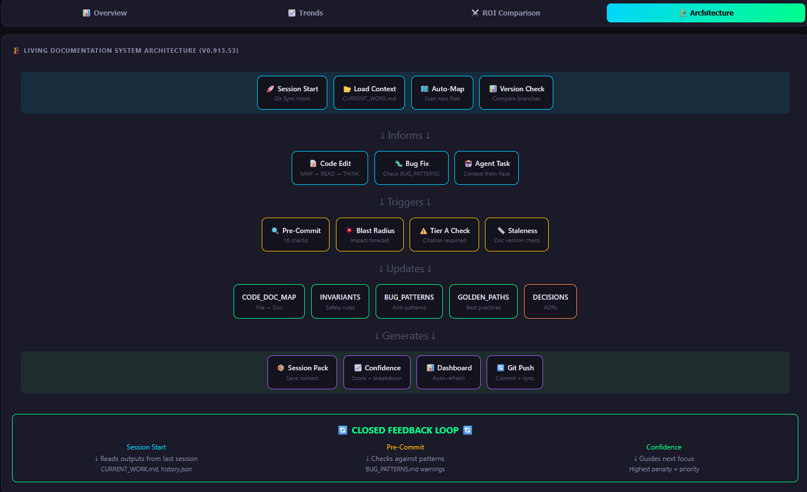
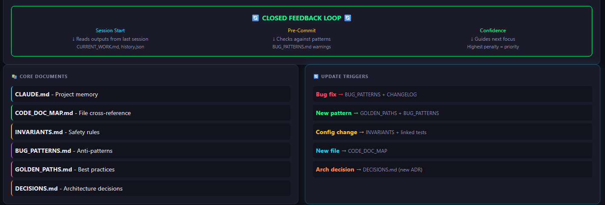
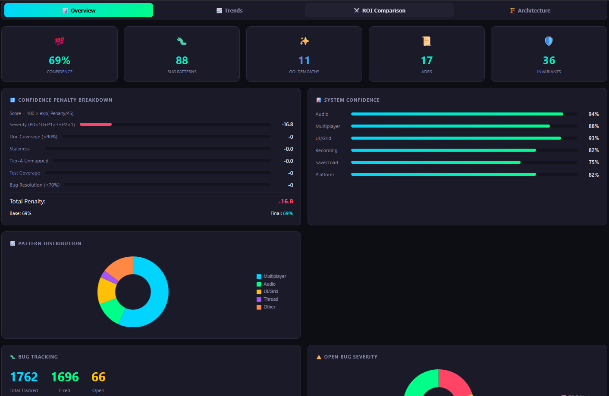
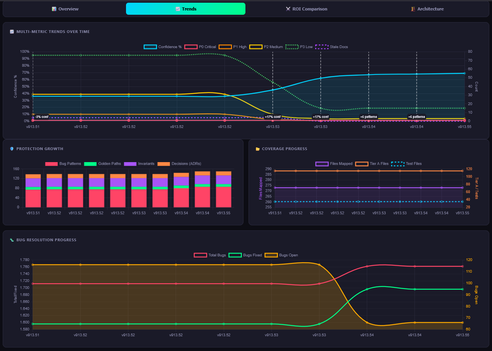

# Living Documentation Framework

**Version:** v1.0.0 | **Status:** Production Ready | **License:** MIT

> A self-aware codebase that knows its own architecture, remembers its mistakes, and enforces its own rules.

---

## The Big Idea

**This is not a documentation tool. It's externalized cognition for software projects.**

Traditional development relies on knowledge that lives in people's heads — architecture decisions, bug patterns, "don't touch that file" warnings, why we did things a certain way. When people leave (or AI sessions end), that knowledge is lost.

This framework makes your **project self-aware**:

| The project knows... | How |
|---------------------|-----|
| Its own architecture | `CODE_DOC_MAP.md` — every file mapped to its docs |
| Its own rules | `INVARIANTS.md` — safety rules that block violations |
| Its own mistakes | `BUG_PATTERNS.md` — documented anti-patterns with detection |
| Its own decisions | `DECISIONS.md` — rationale preserved with context |
| Its own health | Confidence scoring — measurable, not vibes |
| Its own critical points | Tier A files — protected from casual edits |

**The knowledge lives in the repo, not in anyone's head** — human or AI.

---

## Why This Matters Now

AI-assisted development has a fundamental problem: **AI agents are stateless**.

- Sessions end, context is lost
- New session, same bugs reintroduced
- Model upgrades, learned patterns forgotten
- Team changes, tribal knowledge evaporates

Other tools try to solve this by giving AI more context (MCP, RALPH, context files). But context without enforcement is just suggestions that can be ignored.

**This framework does both:**

1. **Delivers fresh, structured context** — architecture, bugs, decisions, patterns, invariants
2. **Enforces at the commit level** — blocks changes that violate documented understanding

```
The AI doesn't need to remember — the codebase remembers for it.
And the codebase enforces what it remembers.
```

---

## What This Framework Is NOT

To set expectations clearly:

- ❌ **Not a replacement for code review** — It reduces careless changes, but human judgment still matters.
- ❌ **Not runtime enforcement** — All guarantees are at commit time, not runtime.
- ❌ **Not an AI framework or model wrapper** — Works with any AI assistant, or none at all.
- ❌ **Not a silver bullet for bad engineering** — It raises the floor, not the ceiling.
- ❌ **Not automatic documentation generation** — Humans and agents must still think. The system enforces correctness, not content quality.

---

## The 30-Second Version

**Problem:** AI agents lose context between sessions. Bugs reappear. Documentation drifts. Critical files get broken.

**Solution:** This framework provides **dual-layer protection**:

1. **Context Layer** — Every session starts with fresh, structured knowledge:
   - Architecture map, bug patterns, invariants, decisions, golden paths
   - AI knows what files do, what broke before, what rules exist

2. **Enforcement Layer** — Git hooks block bad commits:
   ```
   Code change without doc update? → Blocked.
   Tier A file edited without invariant citation? → Blocked.
   Bug fixed without pattern documented? → Warning.
   ```

**Result:** 93% system confidence maintained across 6 months and 181K lines of code.

---

## Why Not Just Use MCP / RALPH / Context Files?

| Approach | What It Does | Limitation |
|----------|--------------|------------|
| **MCP Servers** | Connect AI to external tools/data | No enforcement. AI can ignore context. |
| **RALPH / Memory Systems** | Store conversation history | Memory without governance. No blocking. |
| **Context Files (.claude, AGENTS.md)** | Provide static context to AI | Read-only. No validation. Drifts silently. |
| **Living Documentation** | **Dual-layer: Context + Enforcement** | Requires initial setup investment |

### The Key Difference: Two Layers, Not One

Other tools operate **only at the prompt level** — they give AI more context and hope it uses it.

This framework operates at **both layers**:

**Layer 1: Prompt-Level Context (Like Others, But Better)**
- AI gets **all relevant, fresh context** automatically:
  - Current architecture map (`CODE_DOC_MAP.md`)
  - Known bug patterns and anti-patterns
  - Active invariants and safety rules
  - Historical decisions with rationale
  - Golden paths and best practices
- Context is **structured and validated**, not ad-hoc notes
- Context is **always current** — tied to git, not stale memory

**Layer 2: Commit-Level Enforcement (What Others Don't Have)**
- Git hooks **block commits** that violate documented rules
- Tier A files **require** invariant citations before changes
- Documentation updates are **mandatory**, not optional
- Confidence scoring **degrades automatically** when docs go stale

```
MCP/RALPH:     "Here's context, please use it"        (advisory only)
Living Docs:   "Here's context, AND you must use it"  (enforced)
                    ↓                    ↓
              Layer 1: Fresh           Layer 2: Git hooks
              structured context       block violations
```

### What AI Agents Actually Receive

When an AI agent starts working on your codebase, it gets:

| Context Type | What's Loaded | Why It Matters |
|--------------|---------------|----------------|
| **Architecture** | CODE_DOC_MAP with file → doc mappings | Knows where to look, what docs to read |
| **Bug History** | BUG_PATTERNS with detection greps | Avoids reintroducing known issues |
| **Safety Rules** | INVARIANTS with citation requirements | Knows what cannot be violated |
| **Decisions** | ADRs with rationale and context | Understands *why*, not just *what* |
| **Best Practices** | GOLDEN_PATHS for this codebase | Follows established patterns |
| **Current Health** | Confidence scores, staleness flags | Knows what needs attention |

**This isn't just "more context" — it's the right context, structured for action.**

### The Compound Advantage

```
                    MCP/RALPH                    Living Documentation
                    ─────────                    ────────────────────
Prompt Context:     ✅ Yes (tools/data)          ✅ Yes (structured, validated)
Fresh Context:      ⚠️  Depends on setup         ✅ Yes (git-synced)
Structured:         ❌ Varies                    ✅ Yes (schemas, templates)
Enforced:           ❌ No                        ✅ Yes (git hooks)
Measurable:         ❌ No                        ✅ Yes (confidence scoring)
Self-Healing:       ❌ No                        ✅ Yes (staleness decay)
```

### Why This Matters

- **Session-resistant**: Context survives session boundaries because it's in git, not memory
- **Agent-resistant**: Works regardless of which AI model or version you use
- **Turnover-resistant**: New team members (human or AI) inherit documented decisions
- **Drift-resistant**: Stale documentation automatically degrades confidence scores
- **Quality-resistant**: Bad changes get blocked, not just warned about

---

## A Cognitive System That Builds Itself

This isn't just documentation you write once. It's a **living system that grows with your project** — and the reason agents always get the best possible context.

### The Continuous Loop (Why Agents Get Fresh Context)

```
┌─────────────────────────────────────────────────────────────────┐
│                    THE LIVING DOCUMENTATION LOOP                │
└─────────────────────────────────────────────────────────────────┘

     ┌──────────────┐
     │  Code Change │
     └──────┬───────┘
            │
            ▼
     ┌──────────────┐     Git hooks enforce
     │  Doc Update  │◄─── "no code change without doc update"
     │  (Required)  │
     └──────┬───────┘
            │
            ▼
     ┌──────────────┐
     │  Map Updated │     CODE_DOC_MAP, BUG_PATTERNS,
     │  (Auto)      │     INVARIANTS all stay current
     └──────┬───────┘
            │
            ▼
     ┌──────────────┐
     │  Next Agent  │     Fresh architecture, bugs, decisions
     │  Session     │◄─── loaded from git (not stale memory)
     └──────┬───────┘
            │
            ▼
     ┌──────────────┐
     │  Best Prompt │     Agent knows: what files do, what broke,
     │  Possible    │     what rules exist, why decisions made
     └──────┬───────┘
            │
            ▼
     ┌──────────────┐
     │  Better Code │     Informed changes, fewer mistakes,
     │  Changes     │     respects invariants
     └──────┬───────┘
            │
            └──────────────────────┐
                                   │
     ┌──────────────┐              │
     │  Code Change │◄─────────────┘
     └──────────────┘

            ∞ LOOP CONTINUES ∞
```

**This is why the framework works**: Every code change forces documentation updates. Updated docs mean the architecture map is always current. Current maps mean the next agent session starts with perfect context. Perfect context means better code changes. Better changes loop back.

### ⚠️ The Loop Isn't Fully Closed Yet (Help Wanted)

**Honest reality**: The loop above assumes agents follow protocols. They often don't.

```
The Problem:
┌─────────────┐     ┌─────────────┐     ┌─────────────┐
│   Protocol  │────▶│   AI Agent  │────▶│   Ignores   │
│   Says...   │     │   Receives  │     │   Protocol  │
└─────────────┘     └─────────────┘     └─────────────┘
                                              │
                                              ▼
                                        Loop Breaks
```

**Current safeguards (in this repo):**
- **Git hooks** catch missing docs at commit time (hard block)
- **Confidence decay** makes staleness visible
- **Proof-of-compliance** sections required in agent reports

**Additional safeguards (still in Nebulae, not yet extracted):**
- **Fingerprint system** tracks agent compliance across sessions
- **Session memory packs** preserve context between runs

**What still breaks:**
- Agents skip reading docs before making changes
- Agents update docs superficially (checkbox compliance)
- Sub-agents spawned without protocol context
- No way to verify agent actually loaded context

**🔧 We need better solutions. Ideas from contributors:**

| Idea | Status | Contributor Welcome? |
|------|--------|---------------------|
| Pre-change verification hooks | Concept | ✅ Yes |
| Agent context fingerprinting | In Nebulae, needs extraction | ✅ Help extract & generalize |
| Mandatory context loading proof | Concept | ✅ Yes |
| Protocol injection for sub-agents | Partial | ✅ Yes |
| Runtime compliance monitoring | Not started | ✅ Yes |

**If you have ideas for closing this loop, we want to hear them.** See [Contributing](#contributing) or open a Discussion.

**Other tools break this loop:**
- MCP: Context can drift from reality (no enforcement)
- RALPH: Memory is session-specific, not git-synced
- Static context files: No mechanism to force updates

### The Feedback Loop (What Gets Captured)

```
Bug discovered → Document pattern → Detection rule added → Future bugs caught
     ↓                                                            ↓
Decision made → Record rationale → New dev reads it → Understands why
     ↓                                                            ↓
File edited → Map updated → AI knows what docs to read → Better changes
```

### What Gets Captured

Every time you work, the system learns:

- **Fix a bug?** → Pattern documented, detection grep added, future instances flagged
- **Make an architectural choice?** → Decision recorded, alternatives noted, rationale preserved
- **Touch a critical file?** → Invariant cited, blast radius calculated, change validated
- **Ship a release?** → Confidence scored, gates checked, health measured

### The Compound Effect

After 6 months on Nebulae (181K LOC):
- 64 bug patterns = 64 mistakes that won't repeat
- 36 invariants = 36 rules that can't be violated
- 284 mapped files = every file knows its documentation
- 93% confidence = measurable, not "feels okay"

**The longer you use it, the smarter your codebase becomes.**

---

## Advanced Reasoning Through Enforced Context

One of the most important outcomes isn't enforcement itself — it's the **quality of reasoning** it enables.

### From Local Fixes to System-Level Understanding

**Without enforced documentation**, AI agents typically:
- Search locally for symptoms
- Apply shallow pattern matching
- Fix surface-level issues
- Reintroduce bugs elsewhere
- Require multiple retries and rework cycles

**With Living Documentation**, agents are required to:
- Load the current system map (CODE_DOC_MAP)
- Read invariants before touching critical files
- Check known bug patterns before proposing fixes
- Understand *why* the system is structured this way, not just *how*

This shifts bug fixing from:
```
"Find where it breaks" → "Understand how the system flows and where it is allowed to change"
```

### Flow-Aware Bug Fixing

Because the framework encodes architectural boundaries, data flow assumptions, known failure modes, and historical decisions — agents no longer guess where to look.

They **know**:
- Which subsystems interact
- Which files are high-risk
- Which invariants must not be violated
- Which patterns indicate deeper issues

**Result: Targeted investigation instead of exploratory guessing.**

### Measurable Improvements

After introducing enforced context:

| Metric | Improvement |
|--------|-------------|
| Time to detect complex bugs | ⬇️ Decreased |
| Time to fix cross-subsystem bugs | ⬇️ Significantly reduced |
| Rework cycles | ⬇️ Reduced |
| Bug recurrence | ⬇️ Decreased |
| Token usage per successful fix | ⬇️ Lower |

**Why?** Less time rediscovering system intent. Less time fixing the wrong thing. Less time retrying incomplete solutions.

### Why This Saves Tokens

AI inefficiency comes from: missing context, wrong search space, repeated clarification loops, fixing symptoms instead of causes.

Living Documentation **constrains the search space upfront**:
- Start with the correct mental model
- Eliminate invalid solution paths early
- Avoid violating known constraints
- Produce fewer but higher-quality iterations

### Advanced Bugs Benefit Most

The biggest gains are in bugs that are:
- Cross-cutting
- Timing-related
- State-dependent
- Architectural (not syntax-level)

These require reasoning about **flow**, not just code. Because the framework encodes flow explicitly, agents reason at the level a senior engineer would — without relying on memory or chance.

### The Key Insight

```
The framework doesn't make AI "smarter".
It makes reasoning cheaper, faster, and more reliable.
```

By eliminating ambiguity, preserving intent, and enforcing architectural truth — fixes stick, and both human and AI productivity increase.

---

## The Signals We Collect (Hidden Power)

The framework collects structured signals that enable far more than metrics:

### Structural Signals
- File → Doc mapping (CODE_DOC_MAP)
- Tier-A classification
- Subsystem boundaries
- ADR ownership
- Golden paths coverage

### Risk Signals
- Bug patterns (with categories)
- Severity distribution (P0–P3)
- Blast radius
- Unmapped Tier-A files
- Staleness

### Temporal Signals
- Versioned history
- Confidence deltas
- Bug resolution velocity
- Protection growth over time

### Behavioral Signals
- What breaks often
- What changes together
- Where agents/humans forget docs
- Where fixes don't stick

**This is enough to move from "metrics" → "intelligence."**

---

## Code Intelligence Vision (Roadmap)

We're building toward a **Code Intelligence Map** — a navigable semantic space where code, docs, bugs, and decisions live together.

### Phase 1: Map (Current)
- ✅ Code-to-doc mapping
- ✅ Bug pattern documentation
- ✅ Confidence scoring
- ✅ Dashboard metrics

### Phase 2: Explore (Planned)
- 🔮 **Bug Landscape Explorer** — bugs clustered by category, subsystem, root cause
- 🔮 **Subsystem Health Contracts** — min confidence, max P0/P1, required invariants
- 🔮 **Documentation ROI Detector** — which docs prevent bugs vs dead weight

### Phase 3: Predict (Planned)
- 🔮 **Risk Forecasting** — "This file has 78% chance of regression if edited"
- 🔮 **Change Impact Simulator** — "If this ships, expected confidence delta is..."
- 🔮 **"Next Break" Prediction** — based on patterns and historical data

### Phase 4: Govern (Planned)
- 🔮 **Agent Effectiveness Scoring** — track agent compliance, bug recurrence, token efficiency
- 🔮 **Knowledge Loss Detector** — flag subsystems with high concentration risk
- 🔮 **Automated Release Gates** — block releases based on health contracts

### The Vision

```
Not just "Living Documentation"
→ A system that measures and governs understanding.
```

Nodes: Files, Subsystems, Bug Patterns, Invariants, ADRs, Golden Paths
Edges: "violates", "depends on", "protected by", "frequently breaks with"

Click a subsystem → see open bugs, confidence, most violated invariants
Click a file → see known patterns, ADRs that justify it, historical blast radius

**This is where we're going.**

---

## System Architecture



The architecture is designed around one principle: **every change must update the knowledge base, so the next session starts smarter.**

### The Closed Feedback Loop



**Why this matters for prompt quality:**
- Git hooks ensure docs stay synchronized with code
- CODE_DOC_MAP always reflects current file structure
- BUG_PATTERNS grows with every fix
- INVARIANTS block violations before they happen
- **Result**: When an agent starts, it loads truth, not stale notes

### Core Documents & Update Triggers

| Core Document | Purpose | Updated When |
|--------------|---------|--------------|
| `CLAUDE.md`* | Project memory | Major changes |
| `CODE_DOC_MAP.md` | File cross-reference | New file → add entry |
| `INVARIANTS.md` | Safety rules | Config change → update |
| `BUG_PATTERNS.md` | Anti-patterns | Bug fix → document |
| `GOLDEN_PATHS.md` | Best practices | New pattern → add |
| `DECISIONS.md` | Architecture decisions | Arch decision → new ADR |

*\*`CLAUDE.md` is a legacy filename from the original project. It is model-agnostic and can be renamed (e.g., `PROJECT_CONTEXT.md`).*

### Dashboard Metrics





| Metric | What It Measures |
|--------|------------------|
| **Confidence %** | Overall system health (exponential decay formula) |
| **Bug Patterns** | Documented anti-patterns (mistakes that won't repeat) |
| **Golden Paths** | Best practices codified |
| **ADRs** | Architecture decisions recorded |
| **Invariants** | Safety rules enforced |
| **Subsystem Health** | Per-component confidence (Audio 94%, Multiplayer 88%, etc.) |

---

## What This Framework Does

### Treats Understanding as a First-Class Artifact

| Instead of... | This framework creates... |
|---------------|--------------------------|
| Bugs that reappear | **Bug Patterns** — documented anti-patterns with detection rules |
| Tribal knowledge | **Invariants** — codified safety rules that block violations |
| "Why did we do this?" | **Decisions** — recorded rationale with context |
| Fragile critical files | **Tier A Protection** — enforced review for core code |
| Stale documentation | **Confidence Scoring** — measurable documentation health |

### Enforces at Commit Time

```bash
# What happens when you commit:

✓ Check: Are Tier A files documented?
✓ Check: Is CHANGELOG updated?
✓ Check: Do invariants have citations?
⚠ Warn: Blast radius > 5 files
✗ Block: Missing required documentation
```

---

## Who This Is For

### Solo Developers
- Stop re-debugging the same issues
- Build a knowledge base that compounds over time
- AI assistants become more effective with documented context

### Teams
- Onboard new developers (human or AI) faster
- Reduce "why did we do this?" questions
- Enforce consistency without constant code review

### Enterprises
- Auditable documentation trail
- Measurable system health metrics
- Governance that scales with codebase size

### AI-Heavy Workflows
- Multi-agent systems maintain coherence
- Context persists across session boundaries
- Agents cite invariants, not just code

---

## What's Included

### Core System (17 files)
- **4 JSON Schemas**: Patterns, golden paths, invariants, decisions
- **4 Markdown Templates**: Structured documentation formats
- **2 Manifests**: `manifest.yaml`, `doc-system.yaml`
- **5 Language Profiles**: Python, JavaScript, Go, Rust, C#
- **Configuration Loaders**: Shell + Python

### Automation
- **`calculate_confidence.py`**: Exponential-decay health scoring
- **14 additional tools**: Documented with extraction guide

### Git Hooks
- **`pre-commit`**: Documentation enforcement
- **`post-commit`**: Auto-updates
- **`commit-msg`**: Message validation
- **`install.sh`**: One-command setup

### Protocols
- **`AGENT_PROTOCOL.md`**: Mandatory AI compliance rules
- **Slash commands**: `/living-docs`, `/bug-fix`, `/code-review`

---

## Quick Start

```bash
# 1. Add to your project
git submodule add https://github.com/YOUR_USERNAME/LivingDocFramework.git

# 2. Configure
cp LivingDocFramework/core/project-config.template.yaml living-doc-config.yaml
# Edit living-doc-config.yaml for your project

# 3. Install hooks
./LivingDocFramework/hooks/install.sh

# 4. Initialize documentation
mkdir -p docs
touch CHANGELOG.md BUG_TRACKER.md
cp LivingDocFramework/core/templates/bug-patterns.template.md BUG_PATTERNS.md
touch docs/INVARIANTS.md docs/GOLDEN_PATHS.md docs/DECISIONS.md docs/CODE_DOC_MAP.md

# 5. Check health
python3 LivingDocFramework/tools/calculate_confidence.py
```

See [SETUP.md](SETUP.md) for detailed configuration.

---

## Key Features

### 1. Language-Agnostic
Works with Python, JavaScript, Go, Rust, C#, or any language. Configuration uses placeholders — no hardcoded paths.

```yaml
project:
  name: "MyProject"
  language: "python"
code:
  root: "src/"
  extensions: ["py"]
```

### 2. Automatic Enforcement
Git hooks block commits that violate documentation rules:
- Tier A files require invariant citations
- Code changes require CHANGELOG updates
- Blast-radius warnings for large changes

### 3. AI Agent Compliance
Agents are treated as contributors, not exceptions:
- Must read required docs before changes
- Must update docs after changes
- Must cite invariants for critical files
- Must provide proof-of-compliance in reports

### 4. Confidence Scoring
Measurable health signal using exponential decay:
- Bug severity (P0–P3)
- Documentation coverage and staleness
- Tier A file protection
- Test coverage and bug resolution rate

### 5. Scalable Organization
Subsystems maintain their own documentation:
- Multiplayer subsystem → 17 specialized docs
- Audio subsystem → 8 specialized docs
- No monolithic documentation blob

---

## Proven in Production

Extracted from the **Nebulae project**:

| Metric | Value |
|--------|-------|
| Lines of Code | 181,048 |
| Script Files | 284 |
| Bug Patterns Documented | 64 |
| Enforced Invariants | 36 |
| System Confidence | 93% |
| Production Use | 6+ months |

> **Note**: Nebulae serves as a reference implementation. The framework itself is project-agnostic and has no dependency on Nebulae-specific tooling or structure.

### Key Benefits & ROI


---

## Minimal Adoption Path

You don't need to adopt everything at once.

**Start with just these three files:**
1. `CODE_DOC_MAP.md` — map files to their documentation
2. `BUG_PATTERNS.md` — document bugs as you fix them
3. Pre-commit hook for doc updates

**This alone:**
- Prevents repeat bugs
- Forces context loading before changes
- Improves AI reasoning quality

Invariants, confidence scoring, golden paths, and dashboards can be added incrementally as you see value.

```bash
# Minimal setup (5 minutes)
touch CODE_DOC_MAP.md BUG_PATTERNS.md
cp LivingDocFramework/hooks/pre-commit .git/hooks/
chmod +x .git/hooks/pre-commit
```

---

## Limitations & Hard Lessons

### The Honest Truth: AI Agents Don't Always Follow Protocols

Even with explicit instructions, AI coders frequently:
- Skip reading required docs before making changes
- "Forget" to update documentation after code changes
- Create bug patterns for issues that were already fixed
- Ignore invariant citation requirements
- Provide superficial "proof of compliance" checklists

**This framework helps, but it doesn't solve the problem completely.**

### Failure Modes We've Encountered

| Problem | Frequency | Impact |
|---------|-----------|--------|
| Agent skips doc reading | Common | Makes changes that violate invariants |
| Agent "verifies" without actually checking | Common | Reports bugs that don't exist in current code |
| Agent updates docs superficially | Occasional | Documentation technically updated but unhelpful |
| Agent ignores Tier A warnings | Occasional | Critical files modified without proper review |
| Sub-agents lose protocol context | Common | Task tool spawns agents without governance |

### Safeguards We've Implemented

**For Claude / Primary AI Coder:**
1. **Pre-flight checklists** in AGENT_PROTOCOL.md — explicit "STOP" before proceeding
2. **Mandatory report format** — forces structure even if content is weak
3. **Git hooks as hard blocks** — can't commit without docs (catches what AI missed)
4. **Confidence decay** — stale docs automatically hurt the score (visible consequence)

**For Sub-Agents (Task tool):**
1. **Protocol injection** — AGENT_PROTOCOL block must be included in every agent prompt
2. **Verification requirements** — agents must prove they checked current code, not cached
3. **Proof of compliance section** — mandatory in all agent reports
4. **Escalation path** — if agent returns without docs, don't commit

**For Humans:**
1. **Dashboard visibility** — see confidence score trends over time
2. **Blast radius warnings** — know when changes are high-risk
3. **CODE_DOC_MAP** — single source of truth for what needs what docs

### What Still Doesn't Work Well

- **Agents still skip docs** — protocols are advisory until git hooks catch them
- **Verification is shallow** — agents check boxes without deep verification
- **Context window limits** — large codebases can't fit all relevant docs
- **No runtime enforcement** — only catches issues at commit time
- **Human discipline required** — someone must review agent compliance reports

### Our Recommendation

```
Don't trust. Verify.
```

1. **Review agent reports** — actually read the "proof of compliance"
2. **Spot-check doc updates** — are they meaningful or checkbox-filling?
3. **Run confidence scoring regularly** — watch for unexpected drops
4. **Use git hooks as safety net** — they catch what protocols miss

This framework raises the floor, not the ceiling. It makes careless mistakes harder, but doesn't guarantee careful work.

---

## Tooling & Extraction Status

### What's Fully Extracted (Ready to Use)

| Tool | Purpose | Lines |
|------|---------|-------|
| `calculate_confidence.py` | Exponential-decay confidence scoring | 465 |
| `config.py` | Python configuration loader | 220 |
| `load-config.sh` | Shell configuration loader | ~200 |
| `hooks/pre-commit` | Block commits without doc updates | 136 |
| `hooks/post-commit` | Auto-update triggers | ~30 |
| `hooks/commit-msg` | Message validation | ~50 |
| `hooks/install.sh` | One-command hook setup | ~50 |
| `protocols/AGENT_PROTOCOL.md` | AI agent compliance rules | — |
| `commands/living-docs.md` | Slash command for context loading | — |

All tools use the central config system — **no hardcoded paths**.

### What's Documented (Not Yet Extracted)

These tools exist in the source Nebulae project and are documented with extraction guides:

| Tool | Lines | Status |
|------|-------|--------|
| `dashboard-v3.sh` | 1,511 | 📋 Documented, extraction guide provided |
| `auto-doc-mapper.sh` | 381 | 📋 Documented |
| `spawn-agent.sh` | ~200 | 📋 Documented |
| `session-memory-pack.sh` | ~150 | 📋 Documented |
| `fingerprint-tracker.sh` | ~300 | 📋 In Nebulae, needs extraction |
| 10+ more utilities | various | 📋 See [EXTRACTION_GUIDE.md](tools/EXTRACTION_GUIDE.md) |

### Dashboard

**Current Status**: Dashboard generator is documented but not extracted.

**What would it provide**:
- Grafana-style HTML dashboard with Chart.js
- Historical confidence score tracking
- Bug severity distribution charts
- Subsystem health radar charts
- Auto-generated from `.claude/dashboard/history.json`

**To use dashboards today**:
1. Run `calculate_confidence.py --update` to log scores
2. Manually create dashboard or extract `dashboard-v3.sh` following the guide

**Dashboard paths** (configured in `config.py`):
```
.claude/dashboard/
├── index.html      # Generated dashboard
└── history.json    # Historical metrics
```

### Dynamic Configuration

All extracted tools use the central config system — **no hardcoded paths**:

```python
# Python tools
from config import get_config
config = get_config()
config.find_code_files()      # Respects language profile
config.bug_tracker_path       # Returns correct path
config.code_extensions        # ['py'], ['js'], etc.
```

```bash
# Shell tools
source "$SCRIPT_DIR/../core/load-config.sh"
ldf_find_code                 # Uses configured extensions
$LDF_CODE_ROOT                # From living-doc-config.yaml
$LDF_BUG_TRACKER              # Configured doc path
```

### Why Not All Tools Extracted?

**Pragmatic choice**: The confidence calculator provides ~80% of the value. Dashboard and mapper are nice-to-have but require significant generalization effort.

**You can extract more** using the [EXTRACTION_GUIDE.md](tools/EXTRACTION_GUIDE.md) which documents:
- Line-by-line replacement patterns
- Testing checklist for each language
- Common gotchas

---

## Documentation

| Document | Description |
|----------|-------------|
| [SETUP.md](SETUP.md) | Installation & configuration |
| [Hooks README](hooks/README.md) | Git hook system |
| [Agent Protocol](protocols/AGENT_PROTOCOL.md) | AI agent compliance rules |
| [Commands README](commands/README.md) | Slash command reference |
| [Tools README](tools/README.md) | Tool documentation & extraction |
| [Examples](examples/) | Sample project configurations |

---

## Requirements

**Minimum:** Git, Bash 4.0+, Python 3.8+

**Recommended:** jq, yq, AI coding assistant

---

## Roadmap

- [ ] Extract remaining 13 tools
- [ ] JavaScript/TypeScript example
- [ ] Go example
- [ ] Automated test suite
- [ ] CI/CD integration examples
- [ ] Web-based dashboard viewer

---

## Contributing

We're actively looking for contributors, especially for **closing the agent compliance loop**.

### High-Priority Areas

| Area | Problem | Skills Needed |
|------|---------|---------------|
| **Agent Compliance** | AI agents don't always follow protocols | Prompt engineering, hooks |
| **Fingerprint System Extraction** | Extract from Nebulae, generalize for any project | Python, data structures |
| **Pre-change Hooks** | Verify context was loaded before changes | Shell, git hooks |
| **Sub-agent Protocol Injection** | Ensure spawned agents inherit governance | Prompt engineering |
| **Dashboard Extraction** | Extract from Nebulae (~1,500 lines) | Shell, Chart.js |
| **Session Memory Packs** | Extract from Nebulae, generalize | Shell, Python |

### How to Contribute

1. **Open an Issue** — Describe your idea or the problem you're solving
2. **Join Discussions** — Share approaches, especially for agent compliance
3. **Submit PRs** — Follow the existing patterns in the codebase

### We Especially Want to Hear From You If...

- You've built systems that successfully constrain AI agent behavior
- You have ideas for verifying agents actually loaded context (not just claimed to)
- You've worked on multi-agent orchestration with governance
- You have experience with git hooks for complex validation

**The hardest unsolved problem**: How do you *prove* an AI agent read and understood documentation before making changes?

---

## License

MIT License — see [LICENSE](LICENSE)

---

## Acknowledgments

- **Nebulae Project** — original source (181K LOC Unity project)
- **Claude AI** — development partner
- **Living Documentation community** — inspiration and feedback

---

## Support

- **Issues**: [GitHub Issues](https://github.com/user/living-doc-framework/issues)
- **Discussions**: [GitHub Discussions](https://github.com/user/living-doc-framework/discussions)

---

*Transform scattered context into enforced understanding.*
