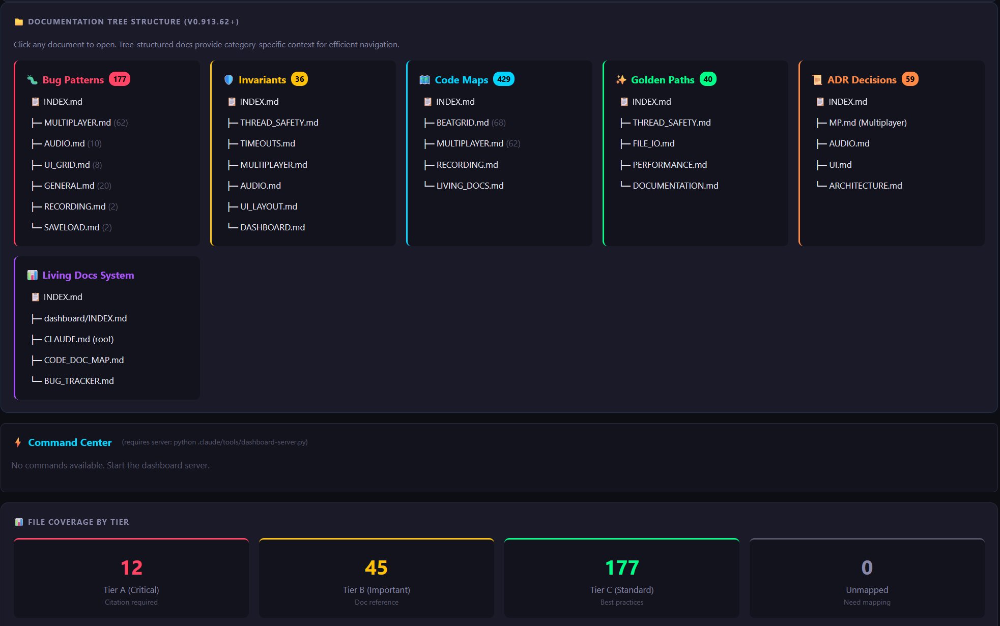

# Living Documentation Framework

> Documentation that enforces itself through git hooks.

**Disclaimer**: This repository documents a documentation enforcement framework, not a full product. Features documented here are extracted and production-tested.



---

## Why This Matters

By mapping code to explicit bug patterns, invariants, and decisions, AI agents receive the correct architectural context upfront. This enables accurate analysis and fixes on first contact with large codebases, cutting debugging and review time from days to hours without repeated prompting.

---

## What It Does

- Maps code files to documentation with tiered enforcement
- Documents bugs as reusable prevention patterns
- Blocks commits that skip documentation updates
- **Scales from 10 to 1000+ files** with per-subsystem doc-sets

**Config-driven**: Paths, extensions, and hook rules are configured in YAML.
**Zero-config scaling**: Doc-sets are discovered automatically from folder structure.

---

## Quick Start

### 1. Add Framework

**Option A: Git Submodule** (recommended)
```bash
git submodule add https://github.com/user-hash/LivingDocFramework.git
```

**Option B: Copy/Vendor**
```bash
cp -r /path/to/LivingDocFramework ./LivingDocFramework
```

### 2. Setup

```bash
# Create config
cp LivingDocFramework/core/project-config.template.yaml living-doc-config.yaml

# Create doc files
mkdir -p docs
touch CODE_DOC_MAP.md BUG_PATTERNS.md CHANGELOG.md
touch docs/INVARIANTS.md docs/GOLDEN_PATHS.md

# Install hooks (requires Bash - use Git Bash on Windows)
./LivingDocFramework/hooks/install.sh
```

---

## Target Folder Structure

### Small Projects (< 20 files)
```
your-project/
├── living-doc-config.yaml    # Controls everything
├── LivingDocFramework/       # Framework
├── CODE_DOC_MAP.md           # File → doc mappings
├── BUG_PATTERNS.md           # Anti-patterns
├── CHANGELOG.md              # Release notes
└── docs/
    ├── INVARIANTS.md         # Safety rules
    └── GOLDEN_PATHS.md       # Best practices
```

### Large Projects (Per-Subsystem Doc-Sets)
```
your-project/
├── living-doc-config.yaml
├── LivingDocFramework/
├── CHANGELOG.md              # Always global
└── docs/
    ├── multiplayer/          # Doc-set (has CODE_DOC_MAP.md)
    │   ├── CODE_DOC_MAP.md   # <- Marker file
    │   ├── INVARIANTS.md     # Subsystem invariants
    │   └── BUG_PATTERNS.md
    ├── audio/                # Another doc-set
    │   ├── CODE_DOC_MAP.md
    │   └── INVARIANTS.md
    └── global/               # Cross-cutting files
        ├── CODE_DOC_MAP.md
        └── INVARIANTS.md
```

**Doc-Set Rule**: Any folder containing `CODE_DOC_MAP.md` is a doc-set. No config needed.

---

## Minimal Configuration

```yaml
project:
  name: "MyProject"
  language: "python"  # python | javascript | go | rust | csharp
  main_branch: "main"

code:
  root: "src/"
  extensions: ["py"]

hooks:
  pre_commit:
    - check: "changelog_updated"
      enabled: true
      blocking: true
```

See [docs/CONFIG.md](docs/CONFIG.md) for full reference.

---

## Core Documents

| Document | Purpose | Location |
|----------|---------|----------|
| `CODE_DOC_MAP.md` | Maps files to their documentation tier | Per doc-set or root |
| `INVARIANTS.md` | Safety rules that block violations | Per doc-set or `docs/` |
| `BUG_PATTERNS.md` | Documented bugs with prevention patterns | Per doc-set or root |
| `CHANGELOG.md` | Release history | Always root (global) |

### Doc-Set Discovery

A **doc-set** is any folder under `docs/` containing `CODE_DOC_MAP.md`:

```
docs/multiplayer/CODE_DOC_MAP.md  →  "multiplayer" doc-set
docs/audio/CODE_DOC_MAP.md        →  "audio" doc-set
```

When you edit a Tier A file listed in a doc-set's `CODE_DOC_MAP.md`, the pre-commit hook requires the **sibling** `INVARIANTS.md` to be updated. No configuration needed.

---

## Documentation

- [Integration Guide](docs/INTEGRATION.md) — Setup for existing codebases
- [Configuration Reference](docs/CONFIG.md) — Full YAML options
- [Git Hooks](hooks/README.md) — Customization
- [Agent Protocol](protocols/AGENT_PROTOCOL.md) — AI agent compliance rules
- [Sample Workflow](examples/sample_workflow/) — How reviewers use docs for fast fixes

---

## Proven in Production

Extracted from the **Nebulae project** (181K LOC, 6+ months production use):

- 64 bug patterns documented
- 36 invariants enforced
- 284 files mapped

---

## Requirements

- Git
- **Bash 4.0+** (required for associative arrays in hooks)
  - macOS: `brew install bash` (default `/bin/bash` is 3.2)
  - Windows: Git Bash (bundled with Git for Windows)
  - Linux: Usually already 4.0+, check with `bash --version`

---

## Community

Join our Discord for questions, feedback, and discussion:

**[Discord Server](https://discord.gg/ygYAAeccTW)**

---

## Contributing

See [CONTRIBUTING.md](CONTRIBUTING.md) for guidelines.

---

## License

AGPL v3 — See [LICENSE](LICENSE)

---

*Transform scattered context into enforced understanding.*
